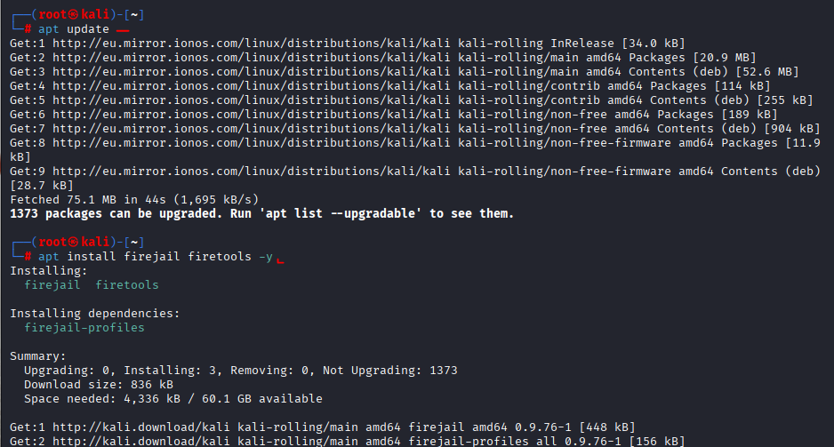
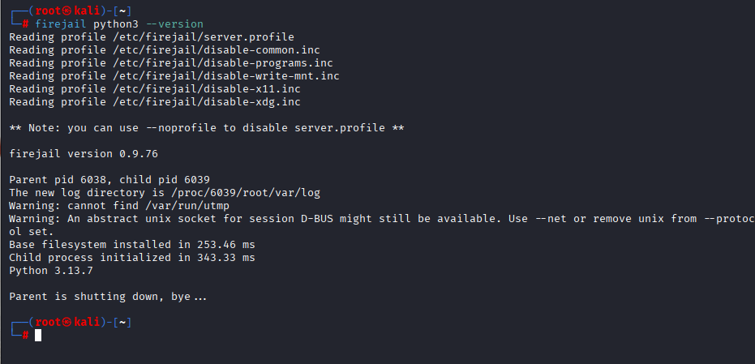
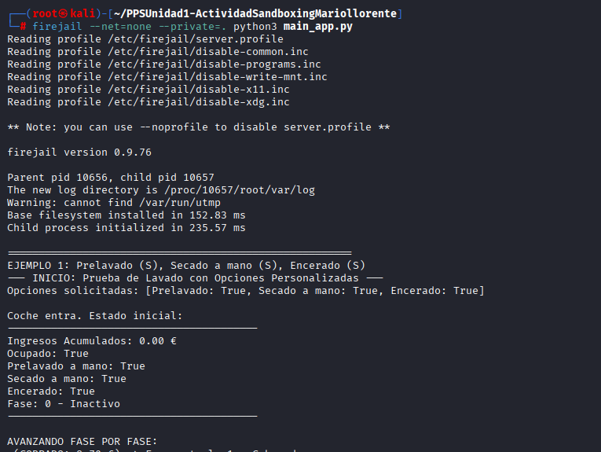
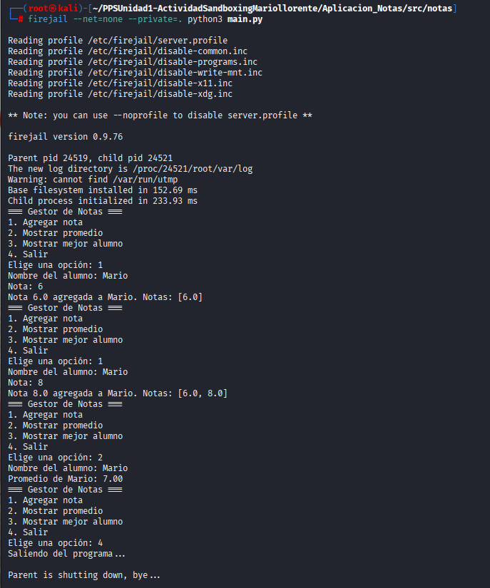
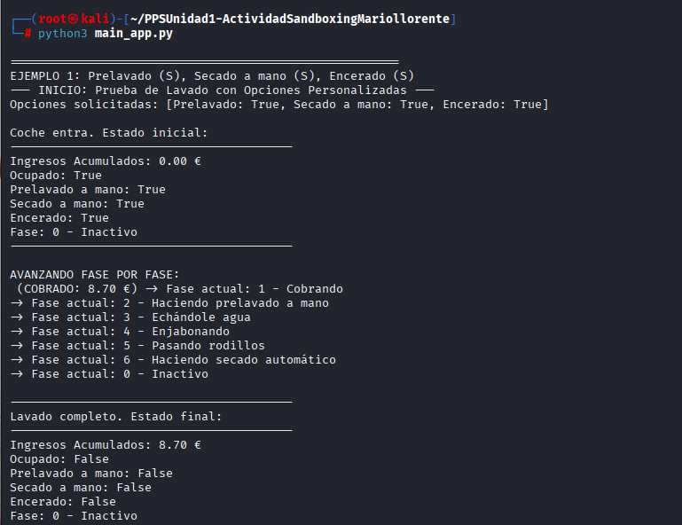
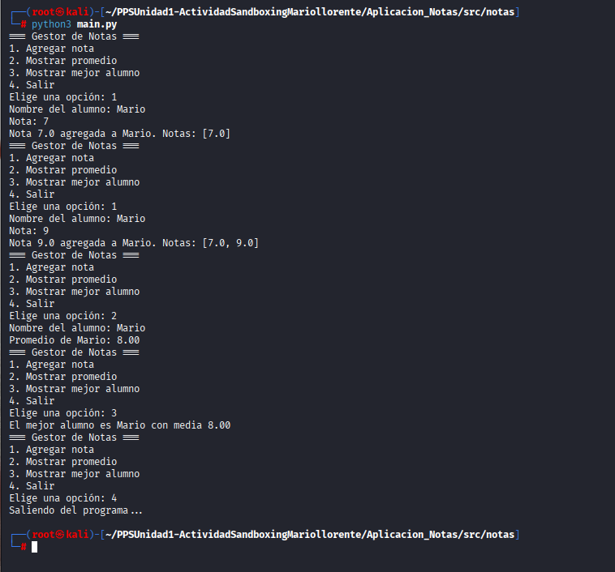
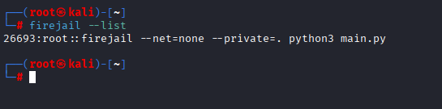
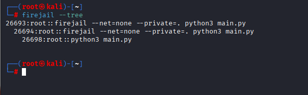

# Entorno Aislado con Firejail

## Introducción
A continuación, detallaré cómo realizar un sandboxing usando **Firejail** para ejecutar de manera segura y aislada las aplicaciones "lavadero" y "notas", desarrolladas en Python.

## ¿Qué es un Sandbox?
El *sandboxing* consiste en ejecutar programas en un entorno limitado, sin acceso directo a los recursos críticos del sistema. Esto resulta útil para:

- Analizar software sospechoso sin comprometer el sistema  
- Probar aplicaciones de manera segura  
- Generar entornos consistentes y reproducibles  
- Prevenir la propagación de malware  
- Restringir el acceso a recursos como archivos y la red  

## Herramienta Empleada: Firejail

### Ventajas de Firejail
- **Aislamiento de procesos:** Utiliza *namespaces* de Linux para separar procesos.  
- **Gestión de recursos:** Permite controlar CPU, memoria y conectividad de red.  
- **Sencillo de usar:** Comandos simples e intuitivos.  
- **Seguridad:** Impide la elevación de privilegios no autorizada.  
- **Perfiles prediseñados:** Incluye configuraciones para aplicaciones comunes.  

---

## Paso 1: Instalación de Firejail

En **Kali Linux**, primero debemos instalar Firejail y su interfaz gráfica:
```
sudo apt update
sudo apt install firejail firetools -y
```

### Comprobación de instalación
Para asegurarnos de que Firejail está operativo:
```
firejail --version
```

---

## Paso 2: Uso Básico de Firejail

### Verificar la versión de Python dentro del sandbox
Podemos ejecutar Python dentro de Firejail para confirmar su funcionamiento:
```
firejail python3 --version
```


Se puede observar:
- Ejecución del comando `firejail python3 --version`  
- Carga de perfiles de seguridad (*default.profile*, *disable-common.inc*)  
- Desactivación de la red  
- Versiones de Firejail y Python dentro del sandbox  

---

## Paso 3: Ejecutar la aplicación "lavadero" y "notas"

### Aislar la aplicación sin acceso a red ni archivos externos
Para iniciar la app de notas en un entorno completamente aislado:
```bash
cd ~/PPSUnidad1-ActividadSandboxingMariollorente
firejail --net=none --private=. python3 main_app.py
```
```bash
cd Aplicacion_Notas/src/notas
firejail --net=none --private=. python3 main.py
```
**Opciones utilizadas:**
- `--net=none`: Bloquea cualquier conexión a Internet.  
- `--private=.`: Crea un sistema de archivos temporal limitado al directorio actual.  



---



Aquí podemos ver:
- La aplicación Gestor de Lavadero y  Notas funcionando correctamente.  
- Menú interactivo para ver estado del lavado y agregar y mostrar notas.  
- Cálculo del promedio dentro del entorno aislado.  

---

## Paso 4: Ejecución sin sandbox (para comparación)

### Ejecutar la aplicación normalmente
Para comparar, ejecutamos la misma aplicación sin Firejail:
```python
python3 main_app.py
```
```python
python3 main.py
```


---



**Ahora se ve claramente**
- La app corre directamente en el sistema.  
- No se aplican restricciones de Firejail.  
- El sistema tiene acceso completo a recursos.  
- **Riesgo:** Si el software fuera malicioso, podría afectar todo el equipo.  

---

## Paso 5: Listado de procesos en Firejail

### Comando para ver procesos activos
Firejail permite inspeccionar los procesos que se ejecutan en el sandbox:
```bash
firejail --list
```


Se muestran:
- PID del proceso principal (Firejail).  
- Comando que se ejecuta dentro del sandbox.  

---

## Paso 6: Visualizar el árbol de procesos

### Jerarquía de procesos
Para ver cómo se organizan los procesos:
```bash
firejail --tree
```
  

Se aprecia:
- Estructura jerárquica de procesos.  
- PID principal y subprocesos.  
- Estado de los procesos (Cuando finalizan).  

---
## Medidas de seguridad aplicadas

✅ **Aislamiento de red:** `--net=none` bloquea conexiones.  
✅ **Sistema de archivos privado:** `--private=.` genera un entorno temporal.  
✅ **Sin privilegios root:** Previene escalada de privilegios.  
✅ **Perfiles de seguridad automáticos:** `default.profile`, `disable-common.inc`.  
✅ **Monitorización de procesos:** `--list` y `--tree`.  
✅ **Reproducibilidad:** La app se ejecuta igual en cada sesión.  

---

## Beneficios de Firejail

- **Protección:** Aísla el sistema de programas riesgosos.  
- **Facilidad:** Comandos intuitivos y fáciles de usar.  
- **Control de recursos:** Configuración precisa de accesos.  
- **Ligero:** Menor sobrecarga que una máquina virtual.  
- **Compatibilidad:** Funciona con apps existentes sin modificaciones.  

---

## Conclusión
Durante esta práctica:  
✓ Instalamos y configuramos Firejail en Kali Linux.  
✓ Ejecutamos aplicaciones Python de forma segura.  
✓ Comprobamos aislamiento de red y archivos.  
✓ Monitorizamos los procesos del sandbox.  
✓ Documentamos todo con capturas.  

**Firejail** es indispensable para desarrolladores y profesionales de seguridad que necesitan ejecutar programas en entornos controlados.
